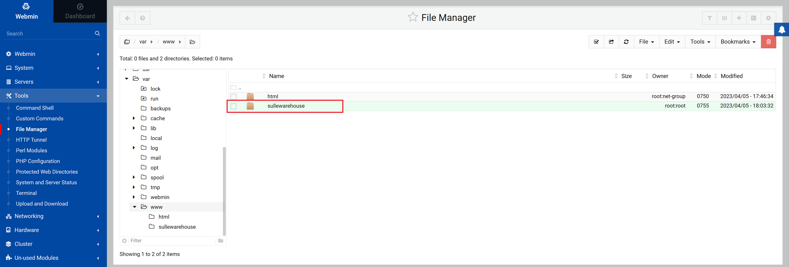
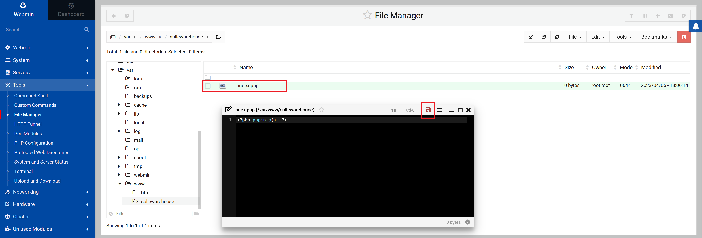
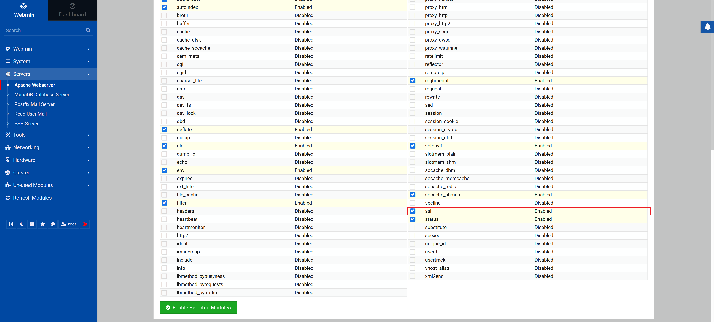
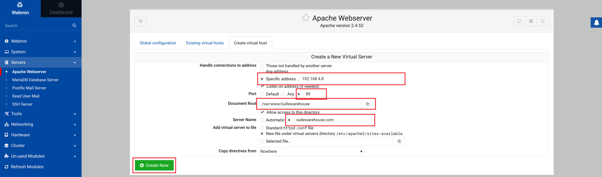
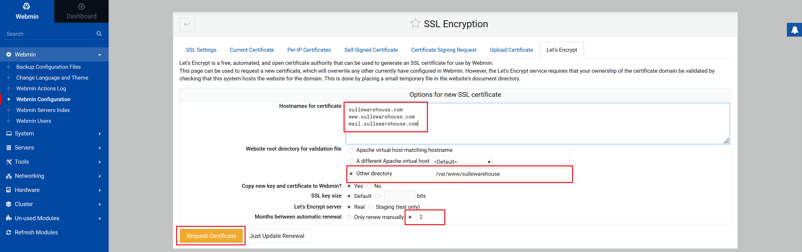
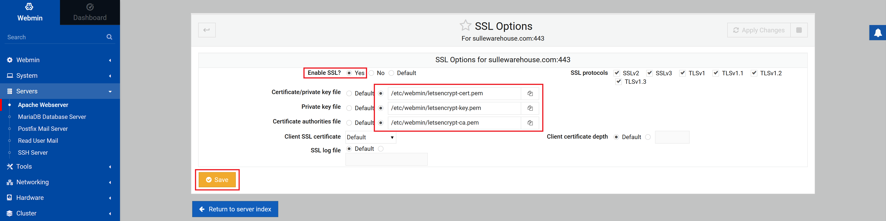
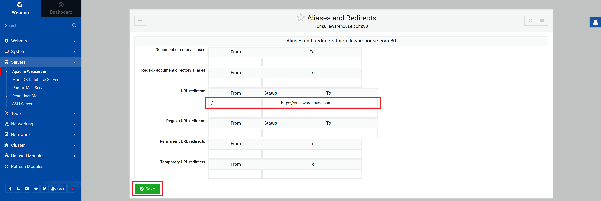
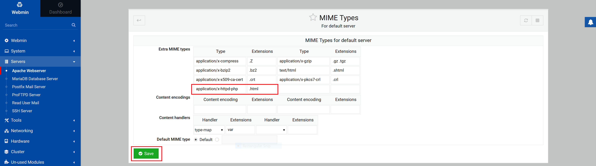

# Apache Webserver Setup
### Introduction
This is the 2nd part of the [Linux Server Setup](LSS.md) walkthrough.  
Previously we installed the following software:
- OpenSSH
- Webmin
- Apache Webserver
- Dovecot IMAP/POP3 Server
- MySQL Database Server
- Postfix Mail Server
- ProFTPD
- PHP

Now we will setup our Apache Webserver with PHP support and SSL encryption.

### Enable PHP Read & Execute Permissions
By default PHP runs as `www-data` user, we need to give that user read & execute permissions for the `/var/www` directory.  
Start by logging into your server with SSH:
```
ssh root@ip-address
```
Create a new group that includes the `www-data` user:
```
groupadd net-group
usermod -a -G net-group www-data
```
Change the group ownership of the `/var/www` directory and its subdirectories to the created group:
```
chown -R :net-group /var/www
```
Change the permissions of the `/var/www` directory and its subdirectories to allow group members to read and execute:
```
chmod -R 750 /var/www
```
`-R` means "recursive", `750` means read, write & execute for owner, read & execute for group, no permissions for others.

If you don't do this you will likely get a blank page in your browser if you use `index.php` for a web page.

### Create Site Directory
Start by logging into your Webmin interface at `https://ip-address:10000/`  
Goto `Tools->File Manager` in the left panel  
Navigate to `/var/www` and create a new directory for your site  
Inside your new directory create a new file named `index.php`, this will be our website home page  
Add `<?php phpinfo(); ?>` to the file and click on the save icon




### Enable SSL
Before you create any Virtual Host's you should enable the SSL module for Apache  
You can use the command `a2enmod ssl` in the terminal to enable it  
Restart Apache using the `systemctl restart Apache2` command

Alternatively you can use Webmin to enable the SSL module by going to `Servers->Apache Webserver`  
Select the `Global configuration` tab, click on `Configure Apache Modules`  
Find `ssl` in the list and select it, click on `Enable Selected Modules`,  
You may need to click on `Apply changes` in the top right corner afterwards



### Create Virtual Host
Goto `Servers->Apache Webserver` in the left panel  
Click on `Create virtual host`  
Select `Specific adress..` and type in your servers IP address  
You can use the command `hostname -I` in the terminal to get your servers IP address  
Set `Port` to 80  
Select your website directory  
Type your `Server Name` (your website .com address)  
Click `Create Now`

Create another Virtual Host with the same settings except use port 443 instead  
Port 443 is for secure connections `HTTPS`, while port 80 is for `HTTP`  
NOTE: You must create a host for port 80 to request an SSL certificate in the next step

**Click Apply changes in the top right corner**



Test that you can access your site via your site address in a browser using `http://`

### Request SSL Certificate
To make your site secure for visitors, you need to get an SSL certificate  
Goto `Webmin->Webmin Configuration` and click on `SSL Encryption`  
Select the `Let's Encrypt` tab  
Type in the hostnames you would like to use for the site  
Select `Other directory` and enter the directory that you created for your site  
Under `Months between automatic renewal` you can set how long before Webmin request's a renewal  
Click on `Request Certificate`  

You may lose connection to Webmin after success  
If this happens close the web browser or tab and open a new one



### Set SSL for Virtual Host
You need to enable SSL for your virtual host that uses port 443  
Goto `Servers->Apache Webserver` and click on the `Existing virtual hosts` tab  
Click on the virtual server that you created for port 443, click on SSL Options  
Select `Yes` under `Enable SSL`  
Set `Certificate/private key file` to `/etc/webmin/letsencrypt-cert.pem`  
Set `Private key file` to `/etc/webmin/letsencrypt-key.pem`  
Set `Certificate authorities file` to `/etc/webmin/letsencrypt-ca.pem`  
Click on `Save`

**Click Apply changes in the top right corner**



Test that you can access your site via your site address in a browser using `https://`  
You should now have a secure connection

### Create URL Redirect
Make sure your site visitors are on a secure connection (port 443) using URL redirect  
Goto `Servers->Apache Webserver` and click on your virtual host for port 80  
Click on `Aliases and Redirects`  
Under `URL redirects`, set `From` to `/` and set `To` to `https://WebSitenName.com`  
Click on `Save`

**Click Apply changes in the top right corner**



### Enable PHP in HTML
Goto `Servers->Apache Webserver`  
Click on the `Default Server` and open `MIME Types`  
Add an extra MIME type, Type = `application/x-httpd-php`, Extensions = `.html`  
Click on `Save`

**Click Apply changes in the top right corner**



# Next
- [Postfix & Dovecot Setup](Postfix-Dovecot-Setup.md)
