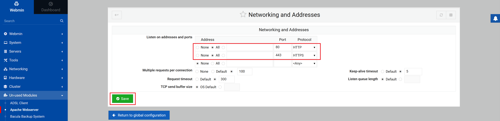
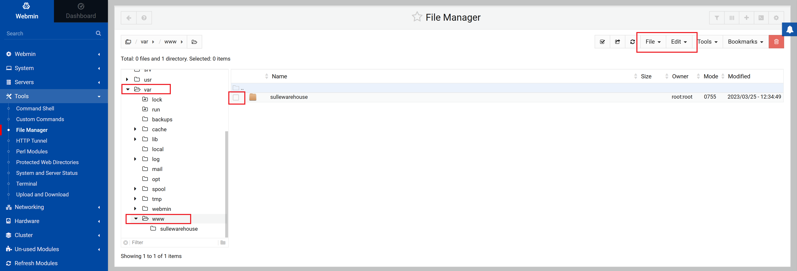
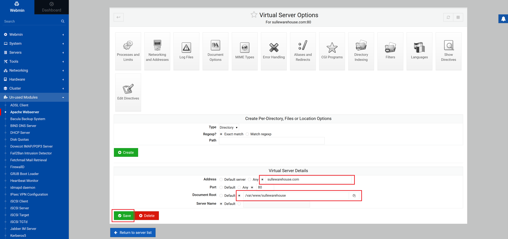

# Apache Webserver Setup
### Setup HTTP and HTTPS port listening  
Goto `Un-used Modules->Apache Webserver` in the left panel  
Select `Global configuration`  
Click on `Networking and Addresses`  
Change the Protocol for port 80 to `HTTP` and add port 443 with protocol `HTTPS`  
Click `Save`



### Create site root directory
Change the default `html` folder name to the name of your site  
Goto `Tools->File Manager` in the left panel  
Navigate to `/var/www` and rename the `html` folder to your-site-name  



### Setup the Virtual Server
Goto `Un-used Modules->Apache Webserver` in the left panel  
Select `Existing virtual hosts` if its not already selected  
Click on the default Virtual Server for port 80  
Set the `address` field to your-site-name.com  
Change the `Document Root` field to the folder for your site  
Click `Save`



Restart Apache Webserver
```
systemctl restart apache2
```
Test that you can access your site via your site address
