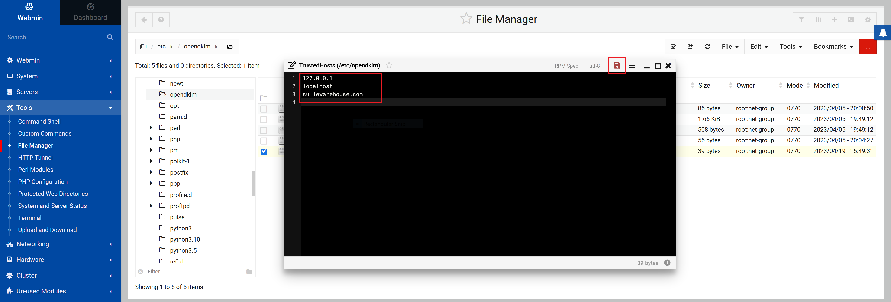
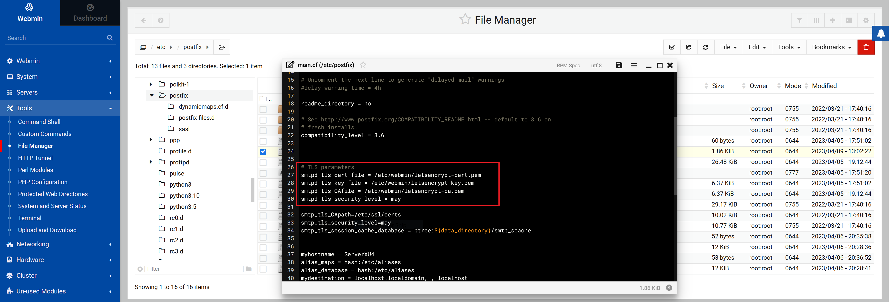
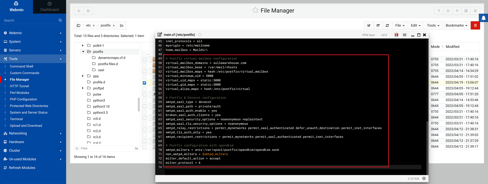

# Postfix & Dovecot Mail Server Setup
### Introduction
This is the 3rd part of the [Linux Server Setup](LSS.md) walkthrough.  
Previously we installed the following software:
- OpenSSH
- Webmin
- Apache Webserver
- Dovecot IMAP/POP3 Server
- MySQL Database Server
- Postfix Mail Server
- ProFTPD
- PHP

Now we will setup our Postfix & Dovecot Mail Server.  
Start by using SSH to login to your server:
```
ssh root@ip-address
```

### Postfix Configuration
Enter postfix setup wizard:
```
dpkg-reconfigure postfix
```

1. Select `Internet Site`
2. Enter your `System mail name`, this should match your Reverse DNS PTR record.
3. Type the `Recipient for root and postmaster mail` you may leave this blank.
4. Enter the `List of domains to receive mail for`  
**NOTE: We are creating virtual domains, so do NOT add your domains here.**
```
localhost.localdomain, , localhost
```
5. Select `Force synchronous updates` option, you can use the default.
6. Enter `Local networks`, you can use defaults.
7. Enter `Mailbox size limit`, you can use the default `0`.
8. Type the `Local address extension character`, you can use the default `+`.
9. For `Internet protocols to use` select `all`

Set postfix to use the `Maildir` format instead of the `mbox` format:
```
postconf -e 'home_mailbox= Maildir\'
```

### OpenDKIM Key Generation
Install and enable opendkim:
```
apt-get install opendkim opendkim-tools
systemctl start opendkim
systemctl enable opendkim
```

Create a opendkim directory and generate dkim keys for your site:
```
mkdir /etc/opendkim
opendkim-genkey -D /etc/opendkim/ --domain example.com --selector mail
```

Set the owner of the opendkim directory to opendkim:
```
chown -R opendkim:opendkim /etc/opendkim
```

### OpenDKIM Configuration
Start by opening a web browser and logging into Webmin.  
Open `/etc/opendkim.conf`  
1. Comment out
```
Socket			local:/run/opendkim/opendkim.sock
```
2. Uncomment
```
Socket			inet:8891@localhost
```
3. Append the following lines:
```
ExternalIgnoreList refile:      /etc/opendkim/TrustedHosts
InternalHosts refile:           /etc/opendkim/TrustedHosts
KeyTable refile:                /etc/opendkim/KeyTable
SigningTable refile:            /etc/opendkim/SigningTable
SignatureAlgorithm              rsa-sha256
```
Save the changes to `/etc/opendkim.conf`  


Create the `/etc/opendkim/TrustedHosts` file and add your domain to it, click on the save icon.



Create the `/etc/opendkim/KeyTable` file and add:
```
mail._domainkey.example.com example.com:mail:/etc/opendkim/dkim.private
```
Replace `example` with your domain name and click the save icon.


Create the `/etc/opendkim/SigningTable` file and add:
```
*@example.com mail._domainkey.example.com
```
Replace `example` with your domain name and click the save icon.


**Restart the server.**

### Configure DKIM DNS records

Create a TXT DNS record that matches `/etc/opendkim/mail.txt`, the record is separated into 3 parts with `"`, you will need to edit out the unwanted characters.


You can test your DKIM DNS record using the following tools:
1. https://dmarcian.com/dkim-inspector/

### Postfix Virtual Mailbox Configuration
Create a directory to store virtual mailboxes along with a `user@example.com` mailbox directory:
```
mkdir -p /var/mail/vhosts/example.com/user
```
Replace ***example.com*** and ***user***

Create a new user named `vmail` with a UID of `5000` and home directory set to `/var/mail/vhosts`:
```
useradd -u 5000 vmail -d /var/mail/vhosts
```

Add the `vmail` user to the `net-group` that we created in the [Apache Setup](Apache-Setup.md) part of this tutorial:
```
usermod -a -G net-group vmail
```

Change the group ownership of the `/var/mail/vhosts` directory and its subdirectories to `net-group`:
```
chown -R :net-group /var/mail/vhosts
```

Change the permissions of the `/var/mail/vhosts` directory and its subdirectories to allow group members to read, write & execute:
```
chmod -R 770 /var/mail/vhosts
```

Create a new `/etc/postfix/virtual_mailbox` file and add the following lines:
```
user@example.com    example.com/user/
```
In this example, mail for `user@example.com` goes to the mailbox at `/var/mail/vhosts/example.com/user/`.

Create a new `/etc/postfix/virtual` file and add the following lines:
```
user@example.com    user@example.com
```


Open the Postfix configuration file `/etc/postfix/main.cf` and set the following SSL configuration:
```
# TLS parameters
smtpd_tls_cert_file = /etc/webmin/letsencrypt-cert.pem
smtpd_tls_key_file = /etc/webmin/letsencrypt-key.pem
smtpd_tls_CAfile = /etc/webmin/letsencrypt-ca.pem
smtpd_tls_security_level = may
```
**NOTE:** The letsencrypt certificate files were created in the [Apache Setup](Apache-Setup.md) part of this tutorial.

Add the following lines to the configuration file:
```
virtual_mailbox_domains = example.com
virtual_mailbox_base = /var/mail/vhosts
virtual_mailbox_maps = hash:/etc/postfix/virtual_mailbox
virtual_minimum_uid = 5000
virtual_uid_maps = static:5000
virtual_gid_maps = static:5000
virtual_alias_maps = hash:/etc/postfix/virtual

smtpd_sasl_type = dovecot
smtpd_sasl_path = private/auth
smtpd_sasl_auth_enable = yes
broken_sasl_auth_clients = yes
smtpd_sasl_security_options = noanonymous noplaintext
smtpd_sasl_tls_security_options = noanonymous
smtpd_relay_restrictions = permit_mynetworks permit_sasl_authenticated defer_unauth_destination
smtpd_tls_auth_only = yes
```
**Click the save icon.**




Run the following commands to update the virtual mailbox mapping files and reload the configuration:
```
postmap /etc/postfix/virtual
postmap /etc/postfix/virtual_mailbox
postfix reload
```

### Dovecot Configuration
Now we can configure Dovecot for remote login.

Create a password file `/etc/dovecot/passwd` and add the following:
```
user:{PLAIN}password::::::
```
Replace `user` and `password` with your actual user and password.

Open `/etc/dovecot/conf.d/10-auth.conf` and edit line 100 `auth_mechanisms` to be:
```
auth_mechanisms = plain login
```

Open `/etc/dovecot/conf.d/auth-system.conf.ext` and edit `passdb` and `userdb` to have the following configuration:
```
passdb {
  driver = passwd-file
  args = /etc/dovecot/passwd
}

userdb {
  driver = passwd-file
  args = /etc/dovecot/passwd
  default_fields = uid=vmail gid=net-group
}
```

Open `/etc/dovecot/conf.d/10-mail.conf` and edit line 30 to be:
```
mail_location = maildir:/var/mail/vhosts/example.com/%n
```
Replace `example.com` with your actual domain name.

Open `/etc/dovecot/conf.d/10-master.conf`, find and edit `Postfix smtp-auth`:
```
service auth {
  ...
  ...

  # Postfix smtp-auth
  unix_listener /var/spool/postfix/private/auth {
    mode = 0660
    user = postfix
    group = postfix
  }
```

Open `/etc/dovecot/conf.d/10-ssl.conf` and set the SSL/TLS certificate files:
```
ssl = yes
...
...

ssl_cert = </etc/webmin/letsencrypt-cert.pem
ssl_key = </etc/webmin/letsencrypt-key.pem
```
**NOTE:** The letsencrypt certificate files were created in the [Apache Setup](Apache-Setup.md) part of this tutorial.

Open `/etc/dovecot/conf.d/20-pop3.conf` and uncomment line 50, it should be:
```
pop3_uidl_format = %08Xu%08Xv
```

Restart Dovecot:
```
systemctl restart dovecot
```

### Test your Mail Server

1. https://www.wormly.com/test-smtp-server

In the terminal, install mailutils:

```
apt-get install mailutils
```

Send a test email using mailutils:
```
sendmail -f "FromUser@domain.com" ToUser@domain.com
Subject: New email address
Hello from my new email server!

```
Press `CTRL+D` to send the email.
