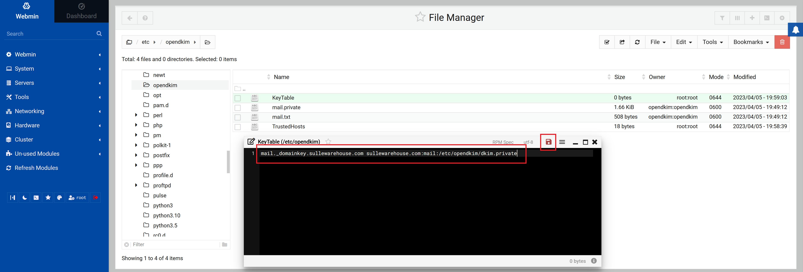
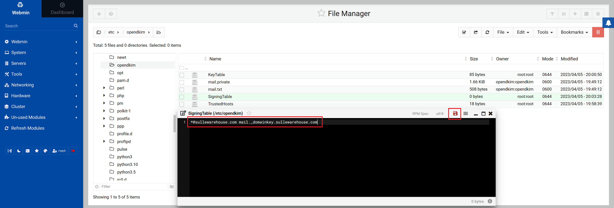

# Postfix & Dovecot Mail Server Setup
### Introduction
This is the 3rd part of the [Linux Server Setup](LSS.md) walkthrough  
Previously we installed the following software:
- OpenSSH
- Webmin
- Apache Webserver
- MySQL Database Server
- Postfix Mail Server
- Dovecot IMAP/POP3 Server
- ProFTPD
- PHP

Now we will setup our Postfix & Dovecot Mail Server.  
Start by using SSH to login to your server:
```
ssh root@ip-address
```

### Postfix Configuration

Enter postfix setup wizard:
```
dpkg-reconfigure postfix
```

1. Select `Internet Site`
2. Enter your `System mail name`, this should match your rDNS PTR record.
3. Type the `Recipient for root and postmaster mail` you may leave this blank.
4. Enter the `List of domains to receive mail for`
```
MyWebSite.com, localhost.localdomain, , localhost
```
5. Select `Force synchronous updates` option, you can use the default.
6. Enter `Local networks`, you can use defaults.
7. Enter `Mailbox size limit`, you can use the default `0`.
8. Type the `Local address extension character`, you can use the default `+`.
9. For `Internet protocols to use` select `all`

Set postfix to use the `Maildir` format instead of the `mbox` format:
```
postconf -e 'home_mailbox= Maildir\'
```

### OpenDKIM Key Generation

Install and enable opendkim:
```
apt-get install opendkim opendkim-tools
systemctl start opendkim
systemctl enable opendkim
```

Create a opendkim directory and generate dkim keys for your site:
```
mkdir /etc/opendkim
opendkim-genkey -D /etc/opendkim/ --domain MyWebSite.com --selector mail
```

Set the owner of the opendkim directory to opendkim:
```
chown -R opendkim:opendkim /etc/opendkim
```

### OpenDKIM Configuration

Open a browser and login to Webmin

Open `/etc/opendkim.conf`  
1. Comment out
```
Socket			local:/run/opendkim/opendkim.sock
```
2. Uncomment
```
Socket			inet:8891@localhost
```
3. Append the following lines:
```
ExternalIgnoreList refile:      /etc/opendkim/TrustedHosts
InternalHosts refile:           /etc/opendkim/TrustedHosts
KeyTable refile:                /etc/opendkim/KeyTable
SigningTable refile:            /etc/opendkim/SigningTable
SignatureAlgorithm              rsa-sha256
```
Save the changes to `/etc/opendkim.conf`  


Create the `/etc/opendkim/TrustedHosts` file and add your domain to it, click on the save icon.


Create the `/etc/opendkim/KeyTable` file and add:
```
mail._domainkey.MyWebSite.com MyWebSite.com:mail:/etc/opendkim/dkim.private
```
Replace MyWebSite with your domain name and click the save icon.



Create the `/etc/opendkim/SigningTable` file and add:
```
*@MyWebSite.com mail._domainkey.MyWebSite.com
```
Replace MyWebSite with your domain name and click the save icon.



**Restart the server.**

### Configure DKIM DNS records

Create a TXT DNS record that matches `/etc/opendkim/mail.txt`, the record is separated into 3 parts with `"`, you will need to edit out the unwanted characters.


### Test Mail Server
1. Use https://dmarcian.com/dkim-inspector/ to check your dkim records.

2. use https://www.wormly.com/test-smtp-server to test your mail server.

Go back to the terminal & install mailutils:

```
apt-get install mailutils
```

Send a test email using mailutils:
```
sendmail MyEmail@gmail.com
Subject: Test
Hello from my email server!

```
Press `CTRL+D` to send the email.
